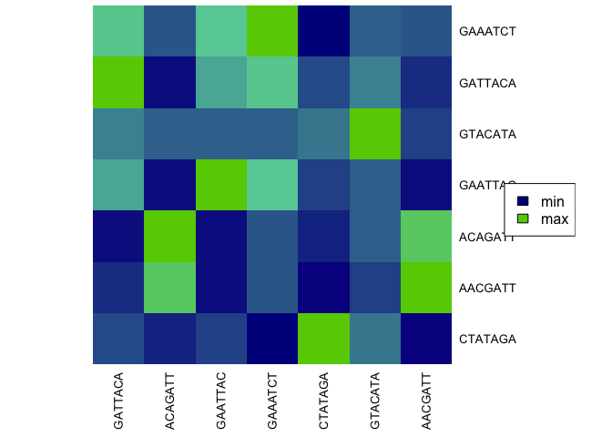

          


# kmeRs: K-mers Similarity Score Matrix and HeatMap 

Similarity Score Matrix and HeatMap for nucleic and amino acid k-mers. Similarity score is evaluated by Point Accepted Mutation (PAM) and BLOcks SUbstitution Matrix (BLOSUM). The 30, 40, 70, 120, 250 and 62, 45, 50, 62, 80, 100 matrix versions are available for PAM and BLOSUM, respectively. Alignment is evaluated by local <sup>[1](#6-references)</sup> and global <sup>[2](#6-references)</sup> alignment.  

[1. Installation](#1-installation)

[2. Documentation](#2-documentation)
- [2.1 Functions](#21-functions)
- [2.2 Examples](#22-examples)
    - [2.3.1 How to display BLOSUM matrix used for amino acides calculation?](#231-how-to-display-blosum-matrix-used-for-amino-acides-calculation)
    - [2.3.2 How to find the most *'different'* k-mer from the *'given'* set of k-mers?](#232-how-to-find-the-most-different-k-mer-from-the-given-set-of-k-mers)
    - [2.3.3 How to find the most *'different'* k-mer to *'whole'* given set of k-mers? ](#233-how-to-find-the-most-different-k-mer-to-whole-given-set-of-k-mers)
    - [2.3.4 How to calculate basic statistics for the matrix?](#234-how-to-calculate-basic-statistics-for-the-matrix)
    - [2.3.5 How to display a similarity matrix as a heatmap?](#235-how-to-display-a-similarity-matrix-as-a-heatmap)
- [2.3 Tutorials](#23-tutorials)
    
[3. Tests](#3-tests)

[4. How to cite](#4-how-to-cite)

[5. Acknowledgement](#5-acknowledgement)

[6. References](#6-references)


## 1. Installation

**Bioconductor Packages** need to be installed first,
```r
if (!requireNamespace("BiocManager", quietly = TRUE))
    install.packages("BiocManager")

BiocManager::install("Biostrings")
BiocManager::install("pwalign")
BiocManager::install("BiocGenerics")
```
**then install from CRAN**
```r
install.packages("kmeRs")
```
**or development version from GitHub**
```r
install.packages("devtools")
devtools::install_github("urniaz/kmeRs/kmeRs/")
```


## 2. Documentation

### 2.1 Functions
The documentation for package including user guides, package vignettes, descriptions of the functions and other documentation is simply accessible by running command below.

```r
# To show the manual and functions' descriptions 
help(package = "kmeRs")
```

### 2.2 Examples

#### 2.3.1 How to display BLOSUM matrix used for amino acides calculation?

Simply apply the **kmeRs_similarity_matrix** function and mark the appropriate matrix, here BLOSUM62.  

```r
# Simple BLOSUM62 similarity matrix for all amino acid nucleotides
  BLOSUM62 <- kmeRs_similarity_matrix(submat = "BLOSUM62")
# Fancy knitr table
  knitr::kable(BLOSUM62)
```


<table style="width:100%;">
<colgroup>
<col style="width: 4%" />
<col style="width: 4%" />
<col style="width: 4%" />
<col style="width: 4%" />
<col style="width: 4%" />
<col style="width: 4%" />
<col style="width: 4%" />
<col style="width: 4%" />
<col style="width: 4%" />
<col style="width: 4%" />
<col style="width: 4%" />
<col style="width: 4%" />
<col style="width: 4%" />
<col style="width: 4%" />
<col style="width: 4%" />
<col style="width: 4%" />
<col style="width: 4%" />
<col style="width: 4%" />
<col style="width: 4%" />
<col style="width: 4%" />
<col style="width: 4%" />
</colgroup>
<thead>
<tr>
<th style="text-align: left;"></th>
<th style="text-align: right;">G</th>
<th style="text-align: right;">A</th>
<th style="text-align: right;">L</th>
<th style="text-align: right;">M</th>
<th style="text-align: right;">F</th>
<th style="text-align: right;">W</th>
<th style="text-align: right;">K</th>
<th style="text-align: right;">Q</th>
<th style="text-align: right;">E</th>
<th style="text-align: right;">S</th>
<th style="text-align: right;">P</th>
<th style="text-align: right;">V</th>
<th style="text-align: right;">I</th>
<th style="text-align: right;">C</th>
<th style="text-align: right;">Y</th>
<th style="text-align: right;">H</th>
<th style="text-align: right;">R</th>
<th style="text-align: right;">N</th>
<th style="text-align: right;">D</th>
<th style="text-align: right;">T</th>
</tr>
</thead>
<tbody>
<tr>
<td style="text-align: left;">G</td>
<td style="text-align: right;">6</td>
<td style="text-align: right;">0</td>
<td style="text-align: right;">-4</td>
<td style="text-align: right;">-3</td>
<td style="text-align: right;">-3</td>
<td style="text-align: right;">-2</td>
<td style="text-align: right;">-2</td>
<td style="text-align: right;">-2</td>
<td style="text-align: right;">-2</td>
<td style="text-align: right;">0</td>
<td style="text-align: right;">-2</td>
<td style="text-align: right;">-3</td>
<td style="text-align: right;">-4</td>
<td style="text-align: right;">-3</td>
<td style="text-align: right;">-3</td>
<td style="text-align: right;">-2</td>
<td style="text-align: right;">-2</td>
<td style="text-align: right;">0</td>
<td style="text-align: right;">-1</td>
<td style="text-align: right;">-2</td>
</tr>
<tr>
<td style="text-align: left;">A</td>
<td style="text-align: right;">0</td>
<td style="text-align: right;">4</td>
<td style="text-align: right;">-1</td>
<td style="text-align: right;">-1</td>
<td style="text-align: right;">-2</td>
<td style="text-align: right;">-3</td>
<td style="text-align: right;">-1</td>
<td style="text-align: right;">-1</td>
<td style="text-align: right;">-1</td>
<td style="text-align: right;">1</td>
<td style="text-align: right;">-1</td>
<td style="text-align: right;">0</td>
<td style="text-align: right;">-1</td>
<td style="text-align: right;">0</td>
<td style="text-align: right;">-2</td>
<td style="text-align: right;">-2</td>
<td style="text-align: right;">-1</td>
<td style="text-align: right;">-2</td>
<td style="text-align: right;">-2</td>
<td style="text-align: right;">0</td>
</tr>
<tr>
<td style="text-align: left;">L</td>
<td style="text-align: right;">-4</td>
<td style="text-align: right;">-1</td>
<td style="text-align: right;">4</td>
<td style="text-align: right;">2</td>
<td style="text-align: right;">0</td>
<td style="text-align: right;">-2</td>
<td style="text-align: right;">-2</td>
<td style="text-align: right;">-2</td>
<td style="text-align: right;">-3</td>
<td style="text-align: right;">-2</td>
<td style="text-align: right;">-3</td>
<td style="text-align: right;">1</td>
<td style="text-align: right;">2</td>
<td style="text-align: right;">-1</td>
<td style="text-align: right;">-1</td>
<td style="text-align: right;">-3</td>
<td style="text-align: right;">-2</td>
<td style="text-align: right;">-3</td>
<td style="text-align: right;">-4</td>
<td style="text-align: right;">-1</td>
</tr>
<tr>
<td style="text-align: left;">M</td>
<td style="text-align: right;">-3</td>
<td style="text-align: right;">-1</td>
<td style="text-align: right;">2</td>
<td style="text-align: right;">5</td>
<td style="text-align: right;">0</td>
<td style="text-align: right;">-1</td>
<td style="text-align: right;">-1</td>
<td style="text-align: right;">0</td>
<td style="text-align: right;">-2</td>
<td style="text-align: right;">-1</td>
<td style="text-align: right;">-2</td>
<td style="text-align: right;">1</td>
<td style="text-align: right;">1</td>
<td style="text-align: right;">-1</td>
<td style="text-align: right;">-1</td>
<td style="text-align: right;">-2</td>
<td style="text-align: right;">-1</td>
<td style="text-align: right;">-2</td>
<td style="text-align: right;">-3</td>
<td style="text-align: right;">-1</td>
</tr>
<tr>
<td style="text-align: left;">F</td>
<td style="text-align: right;">-3</td>
<td style="text-align: right;">-2</td>
<td style="text-align: right;">0</td>
<td style="text-align: right;">0</td>
<td style="text-align: right;">6</td>
<td style="text-align: right;">1</td>
<td style="text-align: right;">-3</td>
<td style="text-align: right;">-3</td>
<td style="text-align: right;">-3</td>
<td style="text-align: right;">-2</td>
<td style="text-align: right;">-4</td>
<td style="text-align: right;">-1</td>
<td style="text-align: right;">0</td>
<td style="text-align: right;">-2</td>
<td style="text-align: right;">3</td>
<td style="text-align: right;">-1</td>
<td style="text-align: right;">-3</td>
<td style="text-align: right;">-3</td>
<td style="text-align: right;">-3</td>
<td style="text-align: right;">-2</td>
</tr>
<tr>
<td style="text-align: left;">W</td>
<td style="text-align: right;">-2</td>
<td style="text-align: right;">-3</td>
<td style="text-align: right;">-2</td>
<td style="text-align: right;">-1</td>
<td style="text-align: right;">1</td>
<td style="text-align: right;">11</td>
<td style="text-align: right;">-3</td>
<td style="text-align: right;">-2</td>
<td style="text-align: right;">-3</td>
<td style="text-align: right;">-3</td>
<td style="text-align: right;">-4</td>
<td style="text-align: right;">-3</td>
<td style="text-align: right;">-3</td>
<td style="text-align: right;">-2</td>
<td style="text-align: right;">2</td>
<td style="text-align: right;">-2</td>
<td style="text-align: right;">-3</td>
<td style="text-align: right;">-4</td>
<td style="text-align: right;">-4</td>
<td style="text-align: right;">-2</td>
</tr>
<tr>
<td style="text-align: left;">K</td>
<td style="text-align: right;">-2</td>
<td style="text-align: right;">-1</td>
<td style="text-align: right;">-2</td>
<td style="text-align: right;">-1</td>
<td style="text-align: right;">-3</td>
<td style="text-align: right;">-3</td>
<td style="text-align: right;">5</td>
<td style="text-align: right;">1</td>
<td style="text-align: right;">1</td>
<td style="text-align: right;">0</td>
<td style="text-align: right;">-1</td>
<td style="text-align: right;">-2</td>
<td style="text-align: right;">-3</td>
<td style="text-align: right;">-3</td>
<td style="text-align: right;">-2</td>
<td style="text-align: right;">-1</td>
<td style="text-align: right;">2</td>
<td style="text-align: right;">0</td>
<td style="text-align: right;">-1</td>
<td style="text-align: right;">-1</td>
</tr>
<tr>
<td style="text-align: left;">Q</td>
<td style="text-align: right;">-2</td>
<td style="text-align: right;">-1</td>
<td style="text-align: right;">-2</td>
<td style="text-align: right;">0</td>
<td style="text-align: right;">-3</td>
<td style="text-align: right;">-2</td>
<td style="text-align: right;">1</td>
<td style="text-align: right;">5</td>
<td style="text-align: right;">2</td>
<td style="text-align: right;">0</td>
<td style="text-align: right;">-1</td>
<td style="text-align: right;">-2</td>
<td style="text-align: right;">-3</td>
<td style="text-align: right;">-3</td>
<td style="text-align: right;">-1</td>
<td style="text-align: right;">0</td>
<td style="text-align: right;">1</td>
<td style="text-align: right;">0</td>
<td style="text-align: right;">0</td>
<td style="text-align: right;">-1</td>
</tr>
<tr>
<td style="text-align: left;">E</td>
<td style="text-align: right;">-2</td>
<td style="text-align: right;">-1</td>
<td style="text-align: right;">-3</td>
<td style="text-align: right;">-2</td>
<td style="text-align: right;">-3</td>
<td style="text-align: right;">-3</td>
<td style="text-align: right;">1</td>
<td style="text-align: right;">2</td>
<td style="text-align: right;">5</td>
<td style="text-align: right;">0</td>
<td style="text-align: right;">-1</td>
<td style="text-align: right;">-2</td>
<td style="text-align: right;">-3</td>
<td style="text-align: right;">-4</td>
<td style="text-align: right;">-2</td>
<td style="text-align: right;">0</td>
<td style="text-align: right;">0</td>
<td style="text-align: right;">0</td>
<td style="text-align: right;">2</td>
<td style="text-align: right;">-1</td>
</tr>
<tr>
<td style="text-align: left;">S</td>
<td style="text-align: right;">0</td>
<td style="text-align: right;">1</td>
<td style="text-align: right;">-2</td>
<td style="text-align: right;">-1</td>
<td style="text-align: right;">-2</td>
<td style="text-align: right;">-3</td>
<td style="text-align: right;">0</td>
<td style="text-align: right;">0</td>
<td style="text-align: right;">0</td>
<td style="text-align: right;">4</td>
<td style="text-align: right;">-1</td>
<td style="text-align: right;">-2</td>
<td style="text-align: right;">-2</td>
<td style="text-align: right;">-1</td>
<td style="text-align: right;">-2</td>
<td style="text-align: right;">-1</td>
<td style="text-align: right;">-1</td>
<td style="text-align: right;">1</td>
<td style="text-align: right;">0</td>
<td style="text-align: right;">1</td>
</tr>
<tr>
<td style="text-align: left;">P</td>
<td style="text-align: right;">-2</td>
<td style="text-align: right;">-1</td>
<td style="text-align: right;">-3</td>
<td style="text-align: right;">-2</td>
<td style="text-align: right;">-4</td>
<td style="text-align: right;">-4</td>
<td style="text-align: right;">-1</td>
<td style="text-align: right;">-1</td>
<td style="text-align: right;">-1</td>
<td style="text-align: right;">-1</td>
<td style="text-align: right;">7</td>
<td style="text-align: right;">-2</td>
<td style="text-align: right;">-3</td>
<td style="text-align: right;">-3</td>
<td style="text-align: right;">-3</td>
<td style="text-align: right;">-2</td>
<td style="text-align: right;">-2</td>
<td style="text-align: right;">-2</td>
<td style="text-align: right;">-1</td>
<td style="text-align: right;">-1</td>
</tr>
<tr>
<td style="text-align: left;">V</td>
<td style="text-align: right;">-3</td>
<td style="text-align: right;">0</td>
<td style="text-align: right;">1</td>
<td style="text-align: right;">1</td>
<td style="text-align: right;">-1</td>
<td style="text-align: right;">-3</td>
<td style="text-align: right;">-2</td>
<td style="text-align: right;">-2</td>
<td style="text-align: right;">-2</td>
<td style="text-align: right;">-2</td>
<td style="text-align: right;">-2</td>
<td style="text-align: right;">4</td>
<td style="text-align: right;">3</td>
<td style="text-align: right;">-1</td>
<td style="text-align: right;">-1</td>
<td style="text-align: right;">-3</td>
<td style="text-align: right;">-3</td>
<td style="text-align: right;">-3</td>
<td style="text-align: right;">-3</td>
<td style="text-align: right;">0</td>
</tr>
<tr>
<td style="text-align: left;">I</td>
<td style="text-align: right;">-4</td>
<td style="text-align: right;">-1</td>
<td style="text-align: right;">2</td>
<td style="text-align: right;">1</td>
<td style="text-align: right;">0</td>
<td style="text-align: right;">-3</td>
<td style="text-align: right;">-3</td>
<td style="text-align: right;">-3</td>
<td style="text-align: right;">-3</td>
<td style="text-align: right;">-2</td>
<td style="text-align: right;">-3</td>
<td style="text-align: right;">3</td>
<td style="text-align: right;">4</td>
<td style="text-align: right;">-1</td>
<td style="text-align: right;">-1</td>
<td style="text-align: right;">-3</td>
<td style="text-align: right;">-3</td>
<td style="text-align: right;">-3</td>
<td style="text-align: right;">-3</td>
<td style="text-align: right;">-1</td>
</tr>
<tr>
<td style="text-align: left;">C</td>
<td style="text-align: right;">-3</td>
<td style="text-align: right;">0</td>
<td style="text-align: right;">-1</td>
<td style="text-align: right;">-1</td>
<td style="text-align: right;">-2</td>
<td style="text-align: right;">-2</td>
<td style="text-align: right;">-3</td>
<td style="text-align: right;">-3</td>
<td style="text-align: right;">-4</td>
<td style="text-align: right;">-1</td>
<td style="text-align: right;">-3</td>
<td style="text-align: right;">-1</td>
<td style="text-align: right;">-1</td>
<td style="text-align: right;">9</td>
<td style="text-align: right;">-2</td>
<td style="text-align: right;">-3</td>
<td style="text-align: right;">-3</td>
<td style="text-align: right;">-3</td>
<td style="text-align: right;">-3</td>
<td style="text-align: right;">-1</td>
</tr>
<tr>
<td style="text-align: left;">Y</td>
<td style="text-align: right;">-3</td>
<td style="text-align: right;">-2</td>
<td style="text-align: right;">-1</td>
<td style="text-align: right;">-1</td>
<td style="text-align: right;">3</td>
<td style="text-align: right;">2</td>
<td style="text-align: right;">-2</td>
<td style="text-align: right;">-1</td>
<td style="text-align: right;">-2</td>
<td style="text-align: right;">-2</td>
<td style="text-align: right;">-3</td>
<td style="text-align: right;">-1</td>
<td style="text-align: right;">-1</td>
<td style="text-align: right;">-2</td>
<td style="text-align: right;">7</td>
<td style="text-align: right;">2</td>
<td style="text-align: right;">-2</td>
<td style="text-align: right;">-2</td>
<td style="text-align: right;">-3</td>
<td style="text-align: right;">-2</td>
</tr>
<tr>
<td style="text-align: left;">H</td>
<td style="text-align: right;">-2</td>
<td style="text-align: right;">-2</td>
<td style="text-align: right;">-3</td>
<td style="text-align: right;">-2</td>
<td style="text-align: right;">-1</td>
<td style="text-align: right;">-2</td>
<td style="text-align: right;">-1</td>
<td style="text-align: right;">0</td>
<td style="text-align: right;">0</td>
<td style="text-align: right;">-1</td>
<td style="text-align: right;">-2</td>
<td style="text-align: right;">-3</td>
<td style="text-align: right;">-3</td>
<td style="text-align: right;">-3</td>
<td style="text-align: right;">2</td>
<td style="text-align: right;">8</td>
<td style="text-align: right;">0</td>
<td style="text-align: right;">1</td>
<td style="text-align: right;">-1</td>
<td style="text-align: right;">-2</td>
</tr>
<tr>
<td style="text-align: left;">R</td>
<td style="text-align: right;">-2</td>
<td style="text-align: right;">-1</td>
<td style="text-align: right;">-2</td>
<td style="text-align: right;">-1</td>
<td style="text-align: right;">-3</td>
<td style="text-align: right;">-3</td>
<td style="text-align: right;">2</td>
<td style="text-align: right;">1</td>
<td style="text-align: right;">0</td>
<td style="text-align: right;">-1</td>
<td style="text-align: right;">-2</td>
<td style="text-align: right;">-3</td>
<td style="text-align: right;">-3</td>
<td style="text-align: right;">-3</td>
<td style="text-align: right;">-2</td>
<td style="text-align: right;">0</td>
<td style="text-align: right;">5</td>
<td style="text-align: right;">0</td>
<td style="text-align: right;">-2</td>
<td style="text-align: right;">-1</td>
</tr>
<tr>
<td style="text-align: left;">N</td>
<td style="text-align: right;">0</td>
<td style="text-align: right;">-2</td>
<td style="text-align: right;">-3</td>
<td style="text-align: right;">-2</td>
<td style="text-align: right;">-3</td>
<td style="text-align: right;">-4</td>
<td style="text-align: right;">0</td>
<td style="text-align: right;">0</td>
<td style="text-align: right;">0</td>
<td style="text-align: right;">1</td>
<td style="text-align: right;">-2</td>
<td style="text-align: right;">-3</td>
<td style="text-align: right;">-3</td>
<td style="text-align: right;">-3</td>
<td style="text-align: right;">-2</td>
<td style="text-align: right;">1</td>
<td style="text-align: right;">0</td>
<td style="text-align: right;">6</td>
<td style="text-align: right;">1</td>
<td style="text-align: right;">0</td>
</tr>
<tr>
<td style="text-align: left;">D</td>
<td style="text-align: right;">-1</td>
<td style="text-align: right;">-2</td>
<td style="text-align: right;">-4</td>
<td style="text-align: right;">-3</td>
<td style="text-align: right;">-3</td>
<td style="text-align: right;">-4</td>
<td style="text-align: right;">-1</td>
<td style="text-align: right;">0</td>
<td style="text-align: right;">2</td>
<td style="text-align: right;">0</td>
<td style="text-align: right;">-1</td>
<td style="text-align: right;">-3</td>
<td style="text-align: right;">-3</td>
<td style="text-align: right;">-3</td>
<td style="text-align: right;">-3</td>
<td style="text-align: right;">-1</td>
<td style="text-align: right;">-2</td>
<td style="text-align: right;">1</td>
<td style="text-align: right;">6</td>
<td style="text-align: right;">-1</td>
</tr>
<tr>
<td style="text-align: left;">T</td>
<td style="text-align: right;">-2</td>
<td style="text-align: right;">0</td>
<td style="text-align: right;">-1</td>
<td style="text-align: right;">-1</td>
<td style="text-align: right;">-2</td>
<td style="text-align: right;">-2</td>
<td style="text-align: right;">-1</td>
<td style="text-align: right;">-1</td>
<td style="text-align: right;">-1</td>
<td style="text-align: right;">1</td>
<td style="text-align: right;">-1</td>
<td style="text-align: right;">0</td>
<td style="text-align: right;">-1</td>
<td style="text-align: right;">-1</td>
<td style="text-align: right;">-2</td>
<td style="text-align: right;">-2</td>
<td style="text-align: right;">-1</td>
<td style="text-align: right;">0</td>
<td style="text-align: right;">-1</td>
<td style="text-align: right;">5</td>
</tr>
</tbody>
</table>

#### 2.3.2 How to find the most *'different'* k-mer from the *'given'* set of k-mers?


In this example, the most *‘different’* k-mer to “GATTACA” sequence will
be indicated from given set of heptamers. Here, 7 heptamer (being an
anagram of the movie title “GATTACA”) are given, as follow:

```r
# Given hexamers
  kmers_given <- c("GATTACA", "ACAGATT", "GAATTAC", "GAAATCT", "CTATAGA", "GTACATA", "AACGATT")
# Matrix calculation 
  kmers_mat <- kmeRs_similarity_matrix(q = c("GATTACA"), x = kmers_given , submat = "BLOSUM62") 
# Fancy knitr table
  knitr::kable(kmers_mat) 
```


<table>
<thead>
<tr>
<th style="text-align: left;"></th>
<th style="text-align: right;">GATTACA</th>
</tr>
</thead>
<tbody>
<tr>
<td style="text-align: left;">GATTACA</td>
<td style="text-align: right;">37</td>
</tr>
<tr>
<td style="text-align: left;">ACAGATT</td>
<td style="text-align: right;">1</td>
</tr>
<tr>
<td style="text-align: left;">GAATTAC</td>
<td style="text-align: right;">15</td>
</tr>
<tr>
<td style="text-align: left;">GAAATCT</td>
<td style="text-align: right;">19</td>
</tr>
<tr>
<td style="text-align: left;">CTATAGA</td>
<td style="text-align: right;">7</td>
</tr>
<tr>
<td style="text-align: left;">GTACATA</td>
<td style="text-align: right;">12</td>
</tr>
<tr>
<td style="text-align: left;">AACGATT</td>
<td style="text-align: right;">4</td>
</tr>
</tbody>
</table>


Now, applying **kmeRs\_score** function the total score is calculated
and the matrix is sorted by increasing score value. The lowest value (in
case of BLOSUM) indicates the most *‘different’* sequence from given
k-mers, in contrast to the highest value which indicates the most
similar one.

```r
# Score and sort the matrix  
  kmers_res <- kmeRs_score(kmers_mat)
# Fancy knitr table
  knitr::kable(kmers_res)
```


<table>
<thead>
<tr>
<th style="text-align: left;"></th>
<th style="text-align: right;">GATTACA</th>
<th style="text-align: right;">Sum</th>
</tr>
</thead>
<tbody>
<tr>
<td style="text-align: left;">ACAGATT</td>
<td style="text-align: right;">1</td>
<td style="text-align: right;">1</td>
</tr>
<tr>
<td style="text-align: left;">AACGATT</td>
<td style="text-align: right;">4</td>
<td style="text-align: right;">4</td>
</tr>
<tr>
<td style="text-align: left;">CTATAGA</td>
<td style="text-align: right;">7</td>
<td style="text-align: right;">7</td>
</tr>
<tr>
<td style="text-align: left;">GTACATA</td>
<td style="text-align: right;">12</td>
<td style="text-align: right;">12</td>
</tr>
<tr>
<td style="text-align: left;">GAATTAC</td>
<td style="text-align: right;">15</td>
<td style="text-align: right;">15</td>
</tr>
<tr>
<td style="text-align: left;">GAAATCT</td>
<td style="text-align: right;">19</td>
<td style="text-align: right;">19</td>
</tr>
<tr>
<td style="text-align: left;">GATTACA</td>
<td style="text-align: right;">37</td>
<td style="text-align: right;">37</td>
</tr>
</tbody>
</table>


As can be observed, the most *‘different’* sequence to GATTACA is
ACAGATT with total score equal to 1 and the most similar to GATTACA
sequence is of course GATTACA sequence with the highest score equal to
37.


#### 2.3.3 How to find the most *'different'* k-mer to *'whole'* given set of k-mers?


In this example, the most *‘different’* k-mer to whole given set of
heptamers will be indicated. The same heptamers as in example 2 are
used.

```r
# Given hexamers
  kmers_given <- c("GATTACA", "ACAGATT", "GAATTAC", "GAAATCT", "CTATAGA", "GTACATA", "AACGATT")
# Matrix calculation 
  kmers_mat <- kmeRs_similarity_matrix(q = kmers_given, submat = "BLOSUM62")
# Score the matrix and sort by decreasing score 
  kmers_res <- kmeRs_score(kmers_mat)
# Fancy knitr table
  knitr::kable(kmers_res)
```


<table>
<colgroup>
<col style="width: 11%" />
<col style="width: 11%" />
<col style="width: 11%" />
<col style="width: 11%" />
<col style="width: 11%" />
<col style="width: 11%" />
<col style="width: 11%" />
<col style="width: 11%" />
<col style="width: 5%" />
</colgroup>
<thead>
<tr>
<th style="text-align: left;"></th>
<th style="text-align: right;">GATTACA</th>
<th style="text-align: right;">ACAGATT</th>
<th style="text-align: right;">GAATTAC</th>
<th style="text-align: right;">GAAATCT</th>
<th style="text-align: right;">CTATAGA</th>
<th style="text-align: right;">GTACATA</th>
<th style="text-align: right;">AACGATT</th>
<th style="text-align: right;">Sum</th>
</tr>
</thead>
<tbody>
<tr>
<td style="text-align: left;">CTATAGA</td>
<td style="text-align: right;">7</td>
<td style="text-align: right;">3</td>
<td style="text-align: right;">6</td>
<td style="text-align: right;">-2</td>
<td style="text-align: right;">37</td>
<td style="text-align: right;">11</td>
<td style="text-align: right;">0</td>
<td style="text-align: right;">62</td>
</tr>
<tr>
<td style="text-align: left;">AACGATT</td>
<td style="text-align: right;">4</td>
<td style="text-align: right;">24</td>
<td style="text-align: right;">1</td>
<td style="text-align: right;">8</td>
<td style="text-align: right;">0</td>
<td style="text-align: right;">6</td>
<td style="text-align: right;">37</td>
<td style="text-align: right;">80</td>
</tr>
<tr>
<td style="text-align: left;">ACAGATT</td>
<td style="text-align: right;">1</td>
<td style="text-align: right;">37</td>
<td style="text-align: right;">1</td>
<td style="text-align: right;">8</td>
<td style="text-align: right;">3</td>
<td style="text-align: right;">9</td>
<td style="text-align: right;">24</td>
<td style="text-align: right;">83</td>
</tr>
<tr>
<td style="text-align: left;">GAATTAC</td>
<td style="text-align: right;">15</td>
<td style="text-align: right;">1</td>
<td style="text-align: right;">37</td>
<td style="text-align: right;">18</td>
<td style="text-align: right;">6</td>
<td style="text-align: right;">9</td>
<td style="text-align: right;">1</td>
<td style="text-align: right;">87</td>
</tr>
<tr>
<td style="text-align: left;">GTACATA</td>
<td style="text-align: right;">12</td>
<td style="text-align: right;">9</td>
<td style="text-align: right;">9</td>
<td style="text-align: right;">9</td>
<td style="text-align: right;">11</td>
<td style="text-align: right;">37</td>
<td style="text-align: right;">6</td>
<td style="text-align: right;">93</td>
</tr>
<tr>
<td style="text-align: left;">GATTACA</td>
<td style="text-align: right;">37</td>
<td style="text-align: right;">1</td>
<td style="text-align: right;">15</td>
<td style="text-align: right;">19</td>
<td style="text-align: right;">7</td>
<td style="text-align: right;">12</td>
<td style="text-align: right;">4</td>
<td style="text-align: right;">95</td>
</tr>
<tr>
<td style="text-align: left;">GAAATCT</td>
<td style="text-align: right;">19</td>
<td style="text-align: right;">8</td>
<td style="text-align: right;">18</td>
<td style="text-align: right;">37</td>
<td style="text-align: right;">-2</td>
<td style="text-align: right;">9</td>
<td style="text-align: right;">8</td>
<td style="text-align: right;">97</td>
</tr>
</tbody>
</table>

As can be observed, the most *‘different’* sequence to all given
heptamers is CTATAGA with score equal to 62 and the most similar
sequence is GAAATCT with the highest score equal to 97.


#### 2.3.4 How to calculate basic statistics for the matrix?


Applying function **kmeRs\_statistics** to the result matrix the basic
statistics can be calculated as additional rows. When
**summary\_statistics\_only** is set to TRUE only summary table is
returned. It is much more elegant way to present results, especially in
case of *‘big data’* output.

```r
# Calculate stats 
  kmers_stats <- kmeRs_statistics(kmers_res)
# Fancy knitr table
  knitr::kable(kmers_stats[ ,1:(dim(kmers_stats)[2] - 4) ])
```


<table>
<colgroup>
<col style="width: 11%" />
<col style="width: 11%" />
<col style="width: 11%" />
<col style="width: 11%" />
<col style="width: 11%" />
<col style="width: 11%" />
<col style="width: 11%" />
<col style="width: 11%" />
<col style="width: 8%" />
</colgroup>
<thead>
<tr>
<th style="text-align: left;"></th>
<th style="text-align: right;">GATTACA</th>
<th style="text-align: right;">ACAGATT</th>
<th style="text-align: right;">GAATTAC</th>
<th style="text-align: right;">GAAATCT</th>
<th style="text-align: right;">CTATAGA</th>
<th style="text-align: right;">GTACATA</th>
<th style="text-align: right;">AACGATT</th>
<th style="text-align: right;">Sum</th>
</tr>
</thead>
<tbody>
<tr>
<td style="text-align: left;">CTATAGA</td>
<td style="text-align: right;">7.00</td>
<td style="text-align: right;">3.00</td>
<td style="text-align: right;">6.00</td>
<td style="text-align: right;">-2.00</td>
<td style="text-align: right;">37.00</td>
<td style="text-align: right;">11.00</td>
<td style="text-align: right;">0.00</td>
<td style="text-align: right;">62.00</td>
</tr>
<tr>
<td style="text-align: left;">AACGATT</td>
<td style="text-align: right;">4.00</td>
<td style="text-align: right;">24.00</td>
<td style="text-align: right;">1.00</td>
<td style="text-align: right;">8.00</td>
<td style="text-align: right;">0.00</td>
<td style="text-align: right;">6.00</td>
<td style="text-align: right;">37.00</td>
<td style="text-align: right;">80.00</td>
</tr>
<tr>
<td style="text-align: left;">ACAGATT</td>
<td style="text-align: right;">1.00</td>
<td style="text-align: right;">37.00</td>
<td style="text-align: right;">1.00</td>
<td style="text-align: right;">8.00</td>
<td style="text-align: right;">3.00</td>
<td style="text-align: right;">9.00</td>
<td style="text-align: right;">24.00</td>
<td style="text-align: right;">83.00</td>
</tr>
<tr>
<td style="text-align: left;">GAATTAC</td>
<td style="text-align: right;">15.00</td>
<td style="text-align: right;">1.00</td>
<td style="text-align: right;">37.00</td>
<td style="text-align: right;">18.00</td>
<td style="text-align: right;">6.00</td>
<td style="text-align: right;">9.00</td>
<td style="text-align: right;">1.00</td>
<td style="text-align: right;">87.00</td>
</tr>
<tr>
<td style="text-align: left;">GTACATA</td>
<td style="text-align: right;">12.00</td>
<td style="text-align: right;">9.00</td>
<td style="text-align: right;">9.00</td>
<td style="text-align: right;">9.00</td>
<td style="text-align: right;">11.00</td>
<td style="text-align: right;">37.00</td>
<td style="text-align: right;">6.00</td>
<td style="text-align: right;">93.00</td>
</tr>
<tr>
<td style="text-align: left;">GATTACA</td>
<td style="text-align: right;">37.00</td>
<td style="text-align: right;">1.00</td>
<td style="text-align: right;">15.00</td>
<td style="text-align: right;">19.00</td>
<td style="text-align: right;">7.00</td>
<td style="text-align: right;">12.00</td>
<td style="text-align: right;">4.00</td>
<td style="text-align: right;">95.00</td>
</tr>
<tr>
<td style="text-align: left;">GAAATCT</td>
<td style="text-align: right;">19.00</td>
<td style="text-align: right;">8.00</td>
<td style="text-align: right;">18.00</td>
<td style="text-align: right;">37.00</td>
<td style="text-align: right;">-2.00</td>
<td style="text-align: right;">9.00</td>
<td style="text-align: right;">8.00</td>
<td style="text-align: right;">97.00</td>
</tr>
<tr>
<td style="text-align: left;">Min</td>
<td style="text-align: right;">1.00</td>
<td style="text-align: right;">1.00</td>
<td style="text-align: right;">1.00</td>
<td style="text-align: right;">-2.00</td>
<td style="text-align: right;">-2.00</td>
<td style="text-align: right;">6.00</td>
<td style="text-align: right;">0.00</td>
<td style="text-align: right;">62.00</td>
</tr>
<tr>
<td style="text-align: left;">Max</td>
<td style="text-align: right;">37.00</td>
<td style="text-align: right;">37.00</td>
<td style="text-align: right;">37.00</td>
<td style="text-align: right;">37.00</td>
<td style="text-align: right;">37.00</td>
<td style="text-align: right;">37.00</td>
<td style="text-align: right;">37.00</td>
<td style="text-align: right;">97.00</td>
</tr>
<tr>
<td style="text-align: left;">Mean</td>
<td style="text-align: right;">13.57</td>
<td style="text-align: right;">11.86</td>
<td style="text-align: right;">12.43</td>
<td style="text-align: right;">13.86</td>
<td style="text-align: right;">8.86</td>
<td style="text-align: right;">13.29</td>
<td style="text-align: right;">11.43</td>
<td style="text-align: right;">85.29</td>
</tr>
<tr>
<td style="text-align: left;">SD</td>
<td style="text-align: right;">12.08</td>
<td style="text-align: right;">13.64</td>
<td style="text-align: right;">12.62</td>
<td style="text-align: right;">12.40</td>
<td style="text-align: right;">13.16</td>
<td style="text-align: right;">10.63</td>
<td style="text-align: right;">13.83</td>
<td style="text-align: right;">12.04</td>
</tr>
</tbody>
</table>


#### 2.3.5 How to display a similarity matrix as a heatmap?


Simply applying function **kmeRs\_heatmap** to the result matrix.

```r
# Heatmap without sum column
  kmeRs_heatmap(kmers_res[, -8])  
```




### 2.3 Tutorials

Package vignettes are avaliable in [/kmeRs/vignettes/](/kmeRs/vignettes/) folder of the repository or directly from the package by command:

```r
# To show the introduction vignette
vignette("Introduction_to_kmeRs_package", package="kmeRs")
```


## 3. Tests

Test are implemented as *continuous integration* by CircleCI. Continuous integration is a DevOps software development practice where code changes are regularly merge into a central repository, after which automated builds and tests are run.

The *source* of tests covering the code of the package are available in [/kmeRs/tests/](/kmeRs/tests/) folder of the repository.


## 4. How to cite

TBA


## 5. Acknowledgement

Special thanks to Jason Lin, PhD from Chiba Cancer Center Research Institute, Chiba, Japan for contribution in 2021 as implementing of heatmap function and update deprecated functions. The kmeRs_generate_kmers and kmeRs_twoSeqSim base on orginal source from tcR and rDNAse, respectively.


## 6. References

1. Needleman, Saul B., and Christian D. Wunsch. 1970. “A General Method Applicable to the Search for Similarities in the Amino Acid Sequence of Two Proteins.” *Journal of Molecular Biology* 48 (3): 443–53. <https://doi.org/10.1016/0022-2836(70)90057-4>.

2. Smith, T. F., and M. S. Waterman. 1981. “Identification of Common Molecular Subsequences.” *Journal of Molecular Biology* 147 (1): 195–97. <https://doi.org/10.1016/0022-2836(81)90087-5>.
