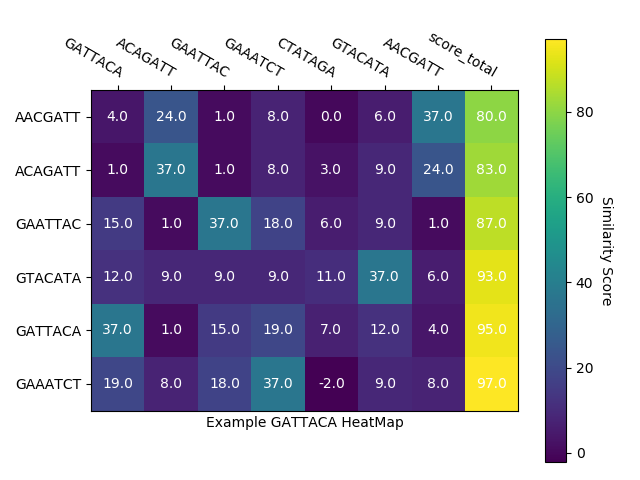

# Summary

In computational science, the *k*-mer term typically refers to all the possible substrings of length *k* that are contained in a given string. In life science (computational genomics) *k*-mers refer to all the possible subsequence (of length *k*) from reads obtained through the DNA/RNA sequencing. KmeRs package [@urniaz01] provides tools to calculate effectively similarity score matrix for DNA *k*-mers. When combined with dedicated visualization Python package heatmap4kmers [@urniaz02] is a comprehensive way to calculate and present results (Picture 1).

-

# Acknowledgment

This work was partially conducted when working at University of Cambridge, UK

# References
